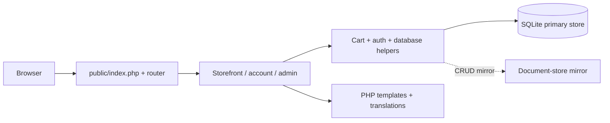

<div align="center">


**[🌐 English](README.md) · [🇮🇷 فارسی](README.fa.md)**

</div>

<div dir="rtl">

# 📦 NEXTSHOP · PHP

**هستهٔ کوچک · ویترین دو زبانه · روندهای روشن**

فروشگاهی دو زبانه با PHP مستقیم؛ نکست‌شاپ کشف محصول، حساب مشتری، سبد خرید، پیگیری سفارش و مدیریت را با یک روتر و لایهٔ MVC کوچک کنار هم قرار می‌دهد. SQLite در اجرای اول فهرست محلی را آماده می‌کند تا راه‌اندازی و بررسی ساختار ساده باشد.

| در یک نگاه | داخل پروژه |
|:---|:---|
| 🎯 تمرکز | ویترین، تجربهٔ مشتری و مدیریت |
| 🧰 Stack | PHP 8.1+ · PDO SQLite · custom MVC/router · plain frontend assets |
| 🌐 راهنما | [English](README.md) · [فارسی](README.fa.md) |
| 🎨 تصویر | [Animated](assets/readme/hero.gif) · [Static](assets/readme/hero.png) |

[✨ تجربهٔ خرید](#experience) · [🚀 اجرای محلی](#setup) · [🧱 معماری](#architecture) · [🌍 استقرار](#deployment)

<a id="experience"></a>

## ✨ از اولین جست‌وجو تا سفارش بعدی

| قابلیت | تجربه |
|:---|:---|
| 🔎 کشف محصول | دسته‌ها، صفحهٔ محصول، مسیر جست‌وجوی سریع و گالری و مشخصات محصول. |
| 🌐 محتوای دو زبانه | رابط انگلیسی/فارسی و فیلدهای ترجمهٔ محصول و دسته. |
| 🛒 سبد خرید | سبد نشست، تغییر تعداد، اعمال کوپن و API خلاصهٔ سبد. |
| 🏠 حساب مشتری | ثبت‌نام، ورود، پروفایل، سفارش‌ها، علاقه‌مندی‌ها و دیدگاه. |
| 📦 سفارش و پیگیری | بررسی نهایی موجودی، اطلاعات ارسال، کد سفارش و صفحهٔ پیگیری. |
| 💳 پرداخت نمونه | روند آزمایشی موفق/ناموفق آنلاین و مسیر پرداخت در محل. |
| 🧑‍💼 مدیریت | محصول، دسته، کاربر، سفارش، کوپن و بنر. |
| 🗄️ آماده‌سازی محلی | ساخت schema در SQLite و فهرست نمونه وقتی جدول‌ها وجود ندارند. |
| 🔑 کنترل‌های برنامه | بررسی CSRF، query پارامتری، کنترل نشست و رمزنگاری اختیاری فیلدها. |

### 🧭 یک دور در فروشگاه

1. سرور PHP را اجرا و `/` را باز کن؛ در اجرای اول دادهٔ نمونهٔ محلی ایجاد می‌شود.
2. در `/shop` محصول را انتخاب و به `/cart` اضافه کن.
3. حساب بساز یا وارد شو و `/checkout` را کامل کن.
4. پرداخت آزمایشی یا پرداخت در محل را امتحان و سفارش و `/track` را بررسی کن.

| مسیر | کاربرد |
|:---|:---|
| `/shop · /category/{slug}` | فهرست و دسته |
| `/product/{slug}` | جزئیات محصول |
| `/cart · /checkout` | سبد و ساخت سفارش |
| `/account · /track` | حساب مشتری و پیگیری |
| `/admin` | مدیریت |
| `/lang/en · /lang/fa` | زبان رابط |

<a id="setup"></a>

## 🚀 اجرای محلی

PHP 8.1+ با PDO SQLite، mbstring و OpenSSL؛ مسیرهای پایگاه داده، mirror اسناد و آپلود باید قابل نوشتن باشند. مسیر محلی مستندشده به Composer یا build با npm نیاز ندارد.

<div dir="ltr">

```bash
git clone https://github.com/MOHAMMADREZAABEDINPOOR/shop3.git
cd shop3

# Copy .env.example to .env.
# Generate APP_KEY and save the output in .env:
php -r "echo base64_encode(random_bytes(32)), PHP_EOL;"
php -S 127.0.0.1:8000 -t public public/router.php
```

</div>

خروجی کلید را پیش از استفاده در `APP_KEY` فایل `.env` ذخیره کن. در اولین درخواست، جدول‌های SQLite و فهرست نمونهٔ مورد نیاز خودکار ایجاد می‌شوند. schema از `database/shop.sqlite` و mirror اسناد از `database/mongodb/` استفاده می‌کند. برای رسانه، `public/uploads/` قابل نوشتن باشد.

آدرس **http://127.0.0.1:8000** را باز کن؛ سرور داخلی برای توسعهٔ محلی است.

### 🧪 حساب‌های نمونه

این حساب‌ها با seed محلی ساخته می‌شوند؛ فقط برای پایگاه دادهٔ تازه و نمونه‌اند. پیش از میزبانی عمومی، حساب‌ها و رمزهای نمونه را جایگزین کن.

| نقش | Email | رمز نمونه |
|:---|:---|:---|
| Admin | `admin@nextshop.ir` | `admin123` |
| Customer | `sara@example.com` | `123456` |

## ⚙️ تنظیمات کاربردی

از [`.env.example`](.env.example) شروع کن؛ مقادیر واقعی در `.env` محلی یا محیط میزبان قرار بگیرند.

| تنظیم | کاربرد |
|:---|:---|
| `APP_NAME / APP_TAGLINE / APP_URL` | نام، شعار و آدرس پایهٔ سایت. |
| `APP_DEBUG` | true محلی؛ false در میزبانی عمومی. |
| `APP_KEY` | کلید ۳۲ بایتی با قالب Base64 برای فیلدهای رمزنگاری‌شده. |
| `DB_DRIVER` | SQLite مسیر محلی مستندشده است. |
| `SESSION_LIFETIME / SESSION_IDLE_TIMEOUT` | ماندگاری و زمان بیکاری نشست به ثانیه. |
| `FORCE_HTTPS` | اجبار HTTPS در میزبانی پروداکشن. |
| `CONTACT_* / GA_ID` | اطلاعات تماس و شناسهٔ اختیاری آمار بازدید. |

<a id="architecture"></a>

## 🧱 اجزای برنامه چگونه کنار هم کار می‌کنند

<div dir="ltr">



</div>

| مسیر | مسئولیت |
|:---|:---|
| [`public/index.php`](public/index.php) · [`public/router.php`](public/router.php) | ورودی وب و روتر توسعهٔ محلی |
| [`app/Controllers/`](app/Controllers/) | عملیات فروشگاه، مشتری و مدیر |
| [`app/Core/`](app/Core/) | روتر، پایگاه داده، schema، seed، ورود، CSRF و زبان |
| [`app/Views/`](app/Views/) · [`app/lang/`](app/lang/) | قالب‌ها و ترجمه‌ها |
| [`database/`](database/) | پایگاه داده و mirror اسناد تولیدشدهٔ محلی |
| [`public/assets/`](public/assets/) · [`public/uploads/`](public/uploads/) | فایل‌های رابط و رسانهٔ آپلودشده |

## 💳 رفتار واقعی پرداخت

صفحهٔ پرداخت آنلاین شبیه‌ساز محلی است و نتیجهٔ انتخاب‌شدهٔ آزمون را روی سفارش اعمال می‌کند؛ به بانک متصل نیست. پرداخت در محل مسیر جدا دارد. برای دریافت وجه آنلاین، سرویس پرداخت واقعی باید اضافه و بررسی شود.

<a id="deployment"></a>

## 🌍 از اجرای محلی تا میزبانی

document root را `public/` قرار بده و مسیرهای برنامه را به `index.php` rewrite کن؛ `public/.htaccess` قواعد Apache دارد. `APP_URL` واقعی، `APP_DEBUG=false`، `FORCE_HTTPS=true` و `APP_KEY` پایدار ۳۲ بایتی را تنظیم کن. پایگاه داده و `.env` خارج از document root بمانند. SQLite مسیر مستند است؛ شاخهٔ MySQL و حالت MongoDB بومی به بررسی جداگانه نیاز دارند. بدون کلید معتبر یا OpenSSL، ذخیرهٔ فیلدها ممکن است به متن ساده برگردد.

## 🧪 بررسی‌های توسعه‌دهندگان

| دستور | هدف |
|:---|:---|
| `php -l public/index.php` | بررسی syntax ورودی برنامه |
| `php -l app/bootstrap.php` | بررسی syntax آماده‌سازی برنامه |
| `php -S 127.0.0.1:8000 -t public public/router.php` | اجرای سرور بررسی محلی |

این‌ها دستورهای بررسی موجودند؛ فهرست آن‌ها به معنی اجرای آزمون کامل برنامه در این تغییر مستندات نیست.

## 🧩 رفع اشکال

| نشانه | راهکار |
|:---|:---|
| درایور پیدا نشد | PDO SQLite را در تنظیمات PHP همین ترمینال فعال کن. |
| تابع mb_* پیدا نشد | افزونهٔ mbstring را فعال کن. |
| مسیرها 404 می‌دهند | در php -S از `public/router.php` استفاده یا rewrite پروداکشن را تنظیم کن. |

## 🧭 سه رویکرد به ساخت فروشگاه

| پروژه | رویکرد |
|:---|:---|
| [SHOP 01](https://github.com/MOHAMMADREZAABEDINPOOR/shop) | دامنه‌های Django، سفارش با کنترل موجودی و داشبورد فروش |
| [SHOP 02](https://github.com/MOHAMMADREZAABEDINPOOR/shop2) | سرویس‌های Laravel، تنوع محصول و مدیریت با نقش |
| [NEXTSHOP](https://github.com/MOHAMMADREZAABEDINPOOR/shop3) | PHP مستقیم، MVC و روتر کوچک و آماده‌سازی SQLite |

## 🤝 بازخورد و مشارکت

در issue، صفحه، رفتار مورد انتظار و مراحل بازتولید را بنویس. تغییر کد را در شاخهٔ مشخص و همراه بررسی مرتبط انجام بده.

[Issues](https://github.com/MOHAMMADREZAABEDINPOOR/shop3/issues) · [PIMX](https://github.com/MOHAMMADREZAABEDINPOOR)

## 📄 مجوز

در این نسخه فایل مجوز در سطح مخزن وجود ندارد؛ برای شرایط استفادهٔ مجدد با مالک هماهنگ کن.

---

<div align="center">

📦 **NEXTSHOP · PHP** · [English](README.md) · [فارسی](README.fa.md)

</div>

</div>
