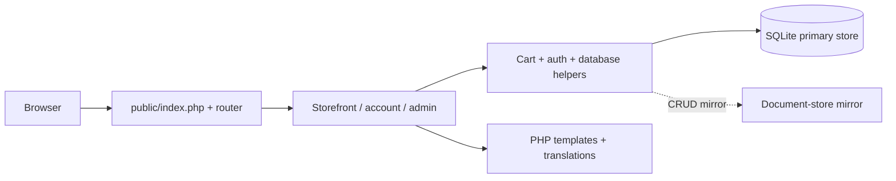

<div align="center">


**[🌐 English](README.md) · [🇮🇷 فارسی](README.fa.md)**

</div>

# 📦 NEXTSHOP · PHP

**SMALL CORE · BILINGUAL STOREFRONT · CLEAR WORKFLOWS**

A compact bilingual storefront built directly with PHP. NextShop brings product discovery, customer accounts, carts, order tracking and an administration area together through a small router and MVC layer. SQLite bootstraps the local catalog on first run, keeping the setup easy to inspect.

| At a glance | What is inside |
|:---|:---|
| 🎯 Focus | Storefront, customer journey and administration |
| 🧰 Stack | PHP 8.1+ · PDO SQLite · custom MVC/router · plain frontend assets |
| 🌐 Documentation | [English](README.md) · [فارسی](README.fa.md) |
| 🎨 Artwork | [Animated](assets/readme/hero.gif) · [Static](assets/readme/hero.png) |

[✨ Experience](#experience) · [🚀 Run locally](#setup) · [🧱 Architecture](#architecture) · [🌍 Deployment](#deployment)

<a id="experience"></a>

## ✨ From the first search to the next order

| Capability | Experience |
|:---|:---|
| 🔎 Discovery | Categories, product pages, live-search endpoints and product galleries/specifications. |
| 🌐 Bilingual content | English/Persian interface and localized product/category fields. |
| 🛒 Shopping cart | Session cart, quantity updates, coupon application and a cart-summary API. |
| 🏠 Customer area | Registration, sign-in, profile, saved orders, wishlists and reviews. |
| 📦 Checkout + tracking | Final stock checks, address capture, order codes and tracking pages. |
| 💳 Payment demo | Simulated online success/failure flow and a cash-on-delivery branch. |
| 🧑‍💼 Administration | Products, categories, users, orders, coupons and banners. |
| 🗄️ Local bootstrap | Creates the SQLite schema and sample catalog when tables are missing. |
| 🔑 Application controls | CSRF checks, prepared database queries, session controls and optional field encryption. |

### 🧭 Take a tour

1. Start the PHP server and open `/`; the first run creates local sample data.
2. Browse `/shop`, choose a product and add it to `/cart`.
3. Create an account or sign in and fill out `/checkout`.
4. Try simulated payment or cash on delivery, then inspect your order and `/track`.

| Route | Purpose |
|:---|:---|
| `/shop · /category/{slug}` | Catalog and category pages |
| `/product/{slug}` | Product detail |
| `/cart · /checkout` | Cart and order creation |
| `/account · /track` | Customer account and tracking |
| `/admin` | Administration |
| `/lang/en · /lang/fa` | Interface locale |

<a id="setup"></a>

## 🚀 Run it locally

PHP 8.1+ with PDO SQLite, mbstring and OpenSSL. The database, document-store mirror and upload directories need write access. No Composer or npm build is required for the documented local path.

```bash
git clone https://github.com/MOHAMMADREZAABEDINPOOR/shop3.git
cd shop3

# Copy .env.example to .env.
# Generate APP_KEY and save the output in .env:
php -r "echo base64_encode(random_bytes(32)), PHP_EOL;"
php -S 127.0.0.1:8000 -t public public/router.php
```

Save the generated key as `APP_KEY` in `.env` before using the app. On the first request, missing SQLite tables and demo catalog data are created automatically. The schema uses `database/shop.sqlite`; the document mirror uses `database/mongodb/`. Keep `public/uploads/` writable for media.

Open **http://127.0.0.1:8000**. The built-in server is for local development.

### 🧪 Demo accounts

Created by the local seed workflow. Use them only in a fresh demonstration database; replace seeded accounts/passwords before public hosting.

| Role | Email | Demo password |
|:---|:---|:---|
| Admin | `admin@nextshop.ir` | `admin123` |
| Customer | `sara@example.com` | `123456` |

## ⚙️ Configuration that matters

Start from [`.env.example`](.env.example); keep real values in your local `.env` or hosting environment.

| Setting | Role |
|:---|:---|
| `APP_NAME / APP_TAGLINE / APP_URL` | Brand and canonical base URL. |
| `APP_DEBUG` | true locally; false on public hosting. |
| `APP_KEY` | Base64-encoded 32-byte key for encrypted fields. |
| `DB_DRIVER` | SQLite is the documented local path. |
| `SESSION_LIFETIME / SESSION_IDLE_TIMEOUT` | Session lifetime and inactivity timeout, in seconds. |
| `FORCE_HTTPS` | Enable HTTPS redirects for production hosting. |
| `CONTACT_* / GA_ID` | Contact details and optional analytics identifier. |

<a id="architecture"></a>

## 🧱 How the application fits together



| Path | Responsibility |
|:---|:---|
| [`public/index.php`](public/index.php) · [`public/router.php`](public/router.php) | Web entry point and local development router |
| [`app/Controllers/`](app/Controllers/) | Storefront, customer and admin actions |
| [`app/Core/`](app/Core/) | Router, database, schema, seed, auth, CSRF and localization |
| [`app/Views/`](app/Views/) · [`app/lang/`](app/lang/) | Templates and translation strings |
| [`database/`](database/) | Generated local database and document mirror |
| [`public/assets/`](public/assets/) · [`public/uploads/`](public/uploads/) | Interface assets and uploaded media |

## 💳 Payment behavior

The online payment screen is a local simulator that marks the order according to the selected test outcome. It is not connected to a bank. Cash on delivery is a separate order branch. Add and validate a real payment provider before accepting online payments.

<a id="deployment"></a>

## 🌍 From local development to hosting

Use `public/` as the web server document root and rewrite application routes to `index.php`; `public/.htaccess` provides Apache rules. Set the real `APP_URL`, `APP_DEBUG=false`, `FORCE_HTTPS=true` and a persistent 32-byte `APP_KEY`. Keep the database and `.env` outside the public document root. SQLite is the documented database path; the MySQL branch and native MongoDB mode need separate deployment validation. Without a valid encryption key/OpenSSL, encrypted fields can fall back to plaintext storage.

## 🧪 Checks for developers

| Command | Purpose |
|:---|:---|
| `php -l public/index.php` | Check the front controller syntax |
| `php -l app/bootstrap.php` | Check application bootstrap syntax |
| `php -S 127.0.0.1:8000 -t public public/router.php` | Start the local smoke-test server |

These are available validation commands, not a claim that the full application was tested during this documentation update.

## 🧩 Troubleshooting

| Symptom | Try this |
|:---|:---|
| Could not find driver | Enable PDO SQLite in the PHP configuration used by this terminal. |
| Call to undefined function mb_* | Enable mbstring. |
| Routes return 404 | Use `public/router.php` with php -S or configure the production rewrite rule. |

## 🧭 Three approaches to commerce

| Project | Approach |
|:---|:---|
| [SHOP 01](https://github.com/MOHAMMADREZAABEDINPOOR/shop) | Django domain apps, stock-aware ordering and an operations dashboard |
| [SHOP 02](https://github.com/MOHAMMADREZAABEDINPOOR/shop2) | Laravel services, product variants and a role-gated back office |
| [NEXTSHOP](https://github.com/MOHAMMADREZAABEDINPOOR/shop3) | Direct PHP, a small MVC/router layer and SQLite bootstrap |

## 🤝 Feedback & contribution

Open an issue with the page, expected behavior and steps to reproduce. For code changes, use a focused branch and the relevant checks.

[Issues](https://github.com/MOHAMMADREZAABEDINPOOR/shop3/issues) · [PIMX](https://github.com/MOHAMMADREZAABEDINPOOR)

## 📄 License

This snapshot has no repository-level license file. Contact the owner for reuse terms.

---

<div align="center">

📦 **NEXTSHOP · PHP** · [English](README.md) · [فارسی](README.fa.md)

</div>
