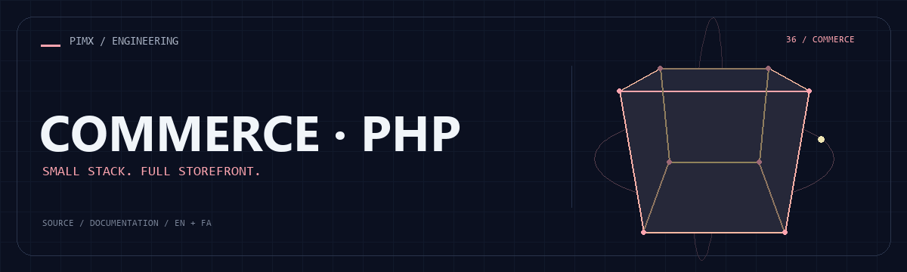

<div align="center">



**[English](README.md) · [فارسی](README.fa.md)**


</div>

# COMMERCE · PHP

A framework-free PHP storefront with a small MVC/router layer, SQLite initialization, customer/admin pages and bilingual product content.

[GitHub](https://github.com/MOHAMMADREZAABEDINPOOR/shop3) · [PIMX / Profile](https://github.com/MOHAMMADREZAABEDINPOOR) · [Static artwork](assets/readme/hero.png)

## Features

- Catalog, categories, reviews and wishlist pages
- Cart, checkout, coupons and order tracking
- Admin product/order/user management
- Session controls, CSRF/rate-limit helpers and locale files

## Stack

| Tool | Version / source |
|---|---|
| PHP | `8.1+ / PDO SQLite` |

## Getting started

PHP 8.1+, PDO SQLite and writable database/ and public/uploads/ directories; cURL/GD are useful for media handling.

```bash
git clone https://github.com/MOHAMMADREZAABEDINPOOR/shop3.git
cd shop3

# Copy .env.example to .env and set APP_KEY
php -r "echo base64_encode(random_bytes(32)), PHP_EOL;"
php -S 127.0.0.1:8000 -t public public/router.php
```

## Configuration

These names are found in the example configuration or source; not all are required. Check their defaults/usage in those files and supply secrets only in your local or hosting environment.

| Name | Role |
|---|---|
| `APP_DEBUG` | Application setting; inspect its definition |
| `APP_KEY` | Credential/connection setting; keep private |
| `APP_NAME` | Application setting; inspect its definition |
| `APP_TAGLINE` | Application setting; inspect its definition |
| `APP_URL` | Application setting; inspect its definition |
| `CONTACT_ADDRESS` | Application setting; inspect its definition |
| `CONTACT_EMAIL` | Application setting; inspect its definition |
| `CONTACT_HOURS` | Application setting; inspect its definition |
| `CONTACT_PHONE` | Application setting; inspect its definition |
| `DB_DRIVER` | Application setting; inspect its definition |
| `DB_HOST` | Application setting; inspect its definition |
| `DB_NAME` | Application setting; inspect its definition |
| `DB_PASS` | Application setting; inspect its definition |
| `DB_PORT` | Application setting; inspect its definition |
| `DB_USER` | Application setting; inspect its definition |
| `FORCE_HTTPS` | Application setting; inspect its definition |
| `GA_ID` | Application setting; inspect its definition |
| `SESSION_IDLE_TIMEOUT` | Application setting; inspect its definition |
| `SESSION_LIFETIME` | Application setting; inspect its definition |
| `SESSION_REMEMBER_DAYS` | Application setting; inspect its definition |

## Usage

Copy .env.example to .env, generate APP_KEY, enable PDO SQLite and start PHP with public/router.php. The SQLite schema/sample content initializes on first use. Set your web-server document root to public/.

## Project structure

| Path | Role |
|---|---|
| [`app/`](app/) | Application routes / PHP application |
| [`assets/`](assets/) | Brand/media/README assets |
| [`database/`](database/) | Database schema/sample resources |
| [`public/`](public/) | Public web assets |
| [`scripts/`](scripts/) | Development and maintenance utilities |

## Commands and checks

No automated test command is declared in a manifest. Verify behavior through a local example run.

## Deployment

Configure production secrets, HTTPS, an independent database and allowed hosts. PHP hosting must use public/ as document root; Django needs static-file and WSGI/ASGI configuration. Development servers are for local use.

## Limitations

Default seeded passwords are only for local demonstration. MySQL configuration and MongoDB export helpers are present, but SQLite is the primary documented path. Do not publish database files or enable APP_DEBUG on public hosting.

## Troubleshooting

- Missing packages: install dependencies using the project’s package manager.
- API/network failure: check the configured origin, provider and hosting bindings.
- Old assets: rebuild when a build script exists, then clear the browser cache.

## Contributing

Create a focused branch, verify the affected behavior and explain the change clearly. Keep private data, build outputs and local databases out of commits.

## License

No repository-level license file is included in this snapshot. Public visibility alone does not grant reuse rights; contact the repository owner for terms.

---

Part of **PIMX** · Documentation in English and Persian.
